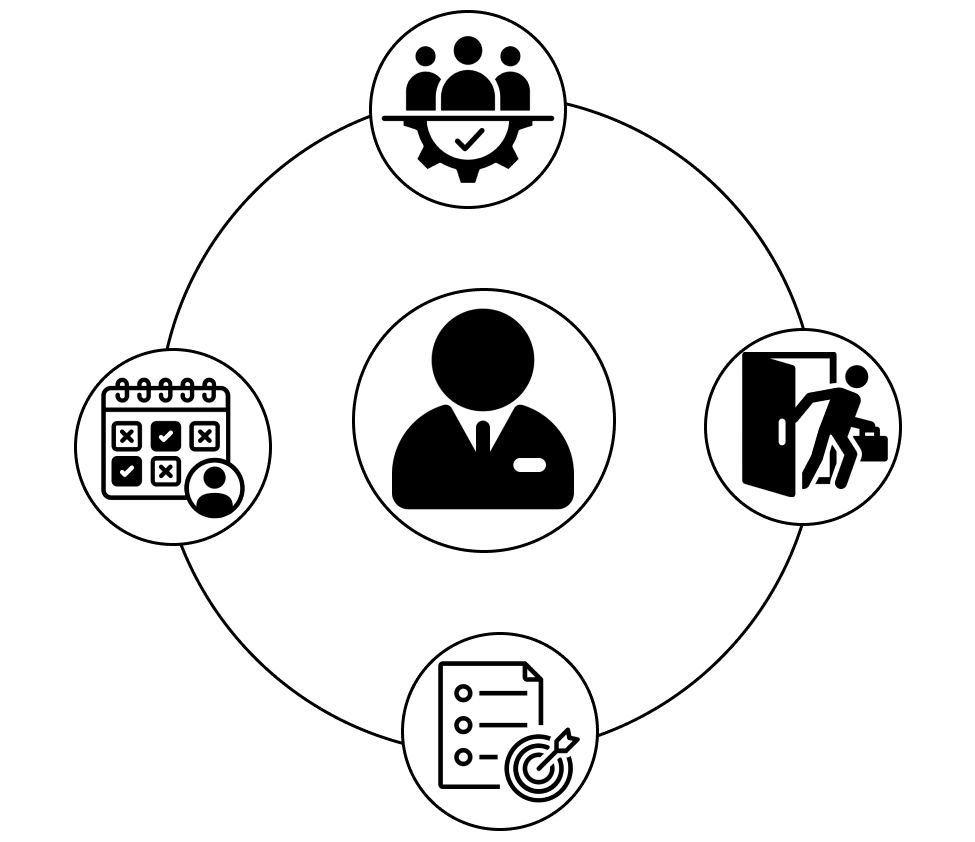

# Introduction

{:width="500px"}*figure: introduction*

<!-- note --> 

Le projet `Gestion Personnels` a été initié sous la direction de `M. Mechrafi`, Directeur Général de l'école. Ce projet, divisé en quatre parties (Personnels, Absences, Congés, Ordre des missions), consiste en la création d'une application web intégrant chacune de ces composantes. Son objectif principal est d'améliorer la gestion des quatre aspects clés des ressources humaines et de fournir des statistiques pertinentes pour éclairer les décisions stratégiques de l'organisation.

Ma partie, la deuxième partie, `Absences`, permet la gestion des absences des employés pour raisons de santé ou personnelles. Elle offre un suivi précis des heures d'absence et des raisons associées, facilitant ainsi la gestion des ressources et le maintien de la continuité opérationnelle.

<!-- new slide -->
